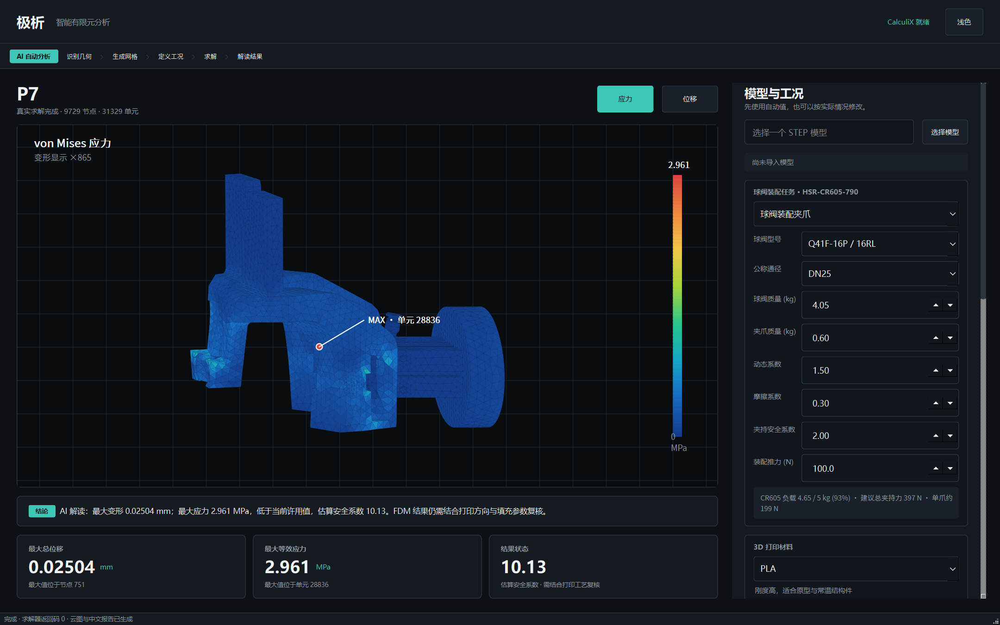
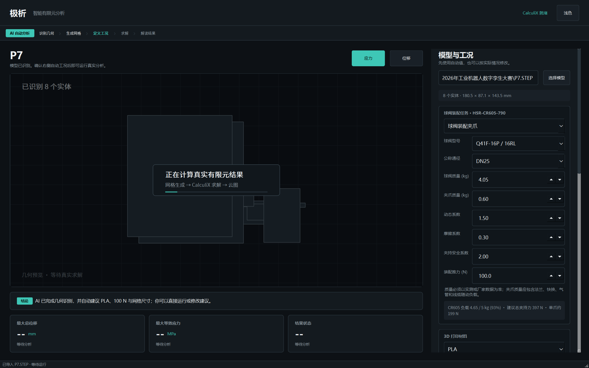

# AI-creat

Engineering code and tools for an industrial-robot assembly competition.

This is a **monorepo**: the root hosts the main project (AI-FEA Valve Gripper)
plus a companion robot-competition skill and a standalone industrial
voice-control example. Each sub-project keeps its own responsibilities,
documentation and license.

> Main project | [AI-FEA Valve Gripper](#ai-fea-valve-gripper) · [robot-competition-copilot](robot-competition-copilot/SKILL.md) · [Industrial Voice Control](industrial-voice-control/README.md)

---

## Repository layout

```
AI-creat/
├── src/ai_fea_mvp/            # Main project: AI-FEA Valve Gripper source (local Gmsh + CalculiX solve)
├── tests/                     # Main project automated tests
├── runtime/ccx/               # CalculiX solver runtime (not committed; see scripts/fetch-ccx.ps1)
├── packaging/                 # Single-file EXE packaging scripts (PyInstaller)
├── assets/                    # Resources required by the GUI (fonts, etc.)
├── docs/                      # Main project docs and UI screenshots
├── scripts/                   # Engineering helper scripts
│   └── fetch-ccx.ps1          #   Downloads the CalculiX solver runtime
├── robot-competition-copilot/ # Robot-competition copilot skill (SKILL.md)
├── industrial-voice-control/  # Standalone sub-project: industrial robot voice control (MIT)
├── .github/workflows/ci.yml   # CI: headless tests for the main project
└── pyproject.toml             # Main project packaging metadata
```

---

## AI-FEA Valve Gripper

A Windows finite-element analysis assistant for automatic-assembly grippers for
Q41F-16P / 16RL flanged ball valves. It performs real meshing and linear-static
solving locally with Gmsh and CalculiX — no cloud solver dependency.





Package documentation: [src/ai_fea_mvp/README.md](src/ai_fea_mvp/README.md)

### What it does

- Imports STEP / STP; automatically recognizes multi-solid assemblies and
  generates tetrahedral meshes.
- Performs a 5 kg rated-payload pre-check against the Huashu HSR-CR605-790.
- Estimates the required grip force from workpiece mass, gripper mass, dynamic
  factor, friction coefficient and grip safety factor, and feeds it into the
  FEA as the total load.
- Ships FDM screening presets for PLA, PLA+, PETG, ABS, ASA, PA, PA-CF, PC and
  TPU 95A.
- Runs the CalculiX solver and shows real von Mises stress / total-displacement
  clouds with max-value markers and a Chinese Markdown report.
- Supports Chinese light/dark themes; key inputs can be overridden on the right.

### Quick start (Windows)

Requires Python 3.10+. The CalculiX solver runtime is not shipped in the repo —
fetch it first:

```powershell
# 1) Prepare the runtime (download the CalculiX solver into runtime/ccx/)
.\scripts\fetch-ccx.ps1

# 2) Install Python dependencies
py -3 -m venv .venv
.\.venv\Scripts\Activate.ps1
python -m pip install --upgrade pip
python -m pip install -e ".[build]"

# 3) Launch the GUI
python run_gui.py
```

Run the tests:

```powershell
$env:PYTHONPATH = "$PWD\src"
$env:QT_QPA_PLATFORM = "offscreen"
python -m unittest discover -s tests -v
```

Build the single-file EXE:

```powershell
.\packaging\build_exe.ps1
```

The artifact is `dist\AI-FEA-Valve-Gripper.exe`.

### Verified P7 example

Under the automatic load case with DN25, ball valve 4.05 kg, gripper 0.60 kg,
dynamic factor 1.5, friction 0.30, grip safety factor 2.0:

| Item | Result |
| --- | ---: |
| CR605 load utilization | 93% |
| Automatic FEA total load | 397.169 N |
| Solids | 8 |
| Nodes / C3D4 elements | 9,729 / 31,329 |
| Max total displacement | 0.0250423 mm |
| Max von Mises stress | 2.9611 MPa |
| CalculiX return code | 0 |

These values come from a real local Gmsh + CalculiX run and are suitable only
for quick screening — they are not a final gripper sign-off.

### Automatic load case and engineering boundaries

Ball-valve-gripper mode refuses calculations above the CR605 rated load and
passes `max(recommended total grip force, assembly thrust)` to the FEA. The
DN25 example leaves ≈0.35 kg of margin; flange, quick-change plate, sensors,
air lines and cables must be added to the gripper mass.

The current MVP's automatic boundary condition fixes the X-min end of each
solid and averages the load over X-max end nodes. It does not represent real
gripper-finger contact, friction, bolted joints, assembly collision or robot
inertial loading. Before production use, complete a real contact definition,
material / print-direction check, mesh-convergence study and experimental
validation. See [docs/mvp_validation.md](docs/mvp_validation.md).

---

## robot-competition-copilot

A copilot skill for the industrial-robot competition (valve sorting and
assembly): CR605/Huazhong PRG programs, gripper iteration, vision, PLC/TIA
signals, IO, points, simulation and safe field debugging. See
[SKILL.md](robot-competition-copilot/SKILL.md).

---

## Industrial Voice Control

A local voice-control reference implementation for industrial-robot Modbus TCP
integration. The public build never connects to, probes or controls any live
robot by default; addresses, ports and registers can only live in a private
ignored configuration file.

Full install, security boundary, tests and release notes are in
[industrial-voice-control/README.md](industrial-voice-control/README.md). That
sub-project is released under [MIT](industrial-voice-control/LICENSE); third-party
font and icon licenses are in its
[THIRD_PARTY_NOTICES](industrial-voice-control/THIRD_PARTY_NOTICES.md).

---

## Development

- **Commits**: Conventional Commits (`feat:` / `fix:` / `docs:` / `refactor:` /
  `chore:` / `test:`); see [CONTRIBUTING.en.md](CONTRIBUTING.en.md)
  ([中文](CONTRIBUTING.md)).
- **CI**: `.github/workflows/ci.yml` runs the main project's headless tests on
  every push / PR.

## License matrix

| Path | License |
| --- | --- |
| Root (main project AI-FEA Valve Gripper and its bundled CalculiX/Gmsh components) | [GPL-2.0](LICENSE) |
| `industrial-voice-control/` (standalone sub-project) | [MIT](industrial-voice-control/LICENSE) |
| Third-party components | [THIRD_PARTY_NOTICES.md](THIRD_PARTY_NOTICES.md) |

> Read the full license text before use, modification or distribution.
